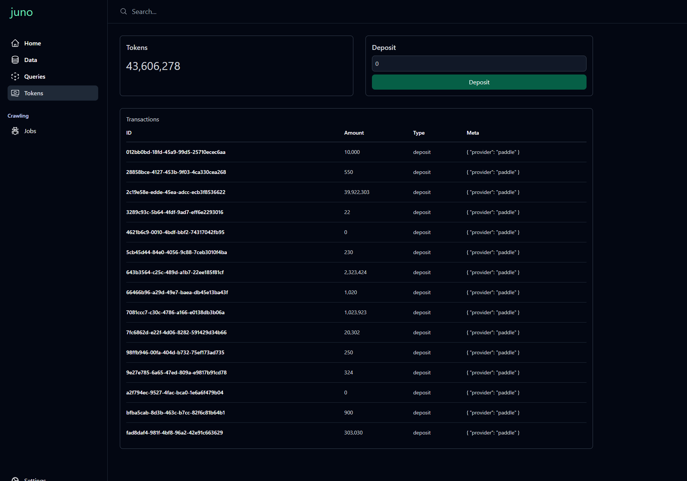

## Juno

*This is not production-ready, and many features are still in progress.*

A community-driven distributed search engine where independent node operators power crawling and query operations.

Progamatic search ability is available via the Monkey programming language, securely executed within 100,000 shards.

